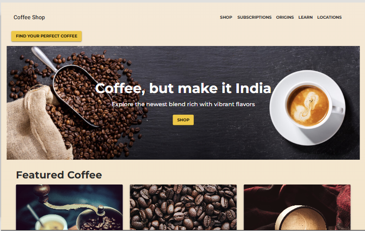
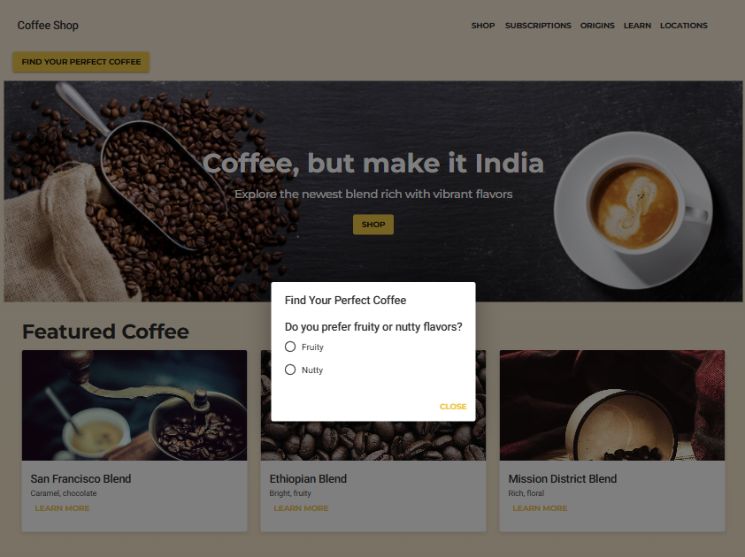
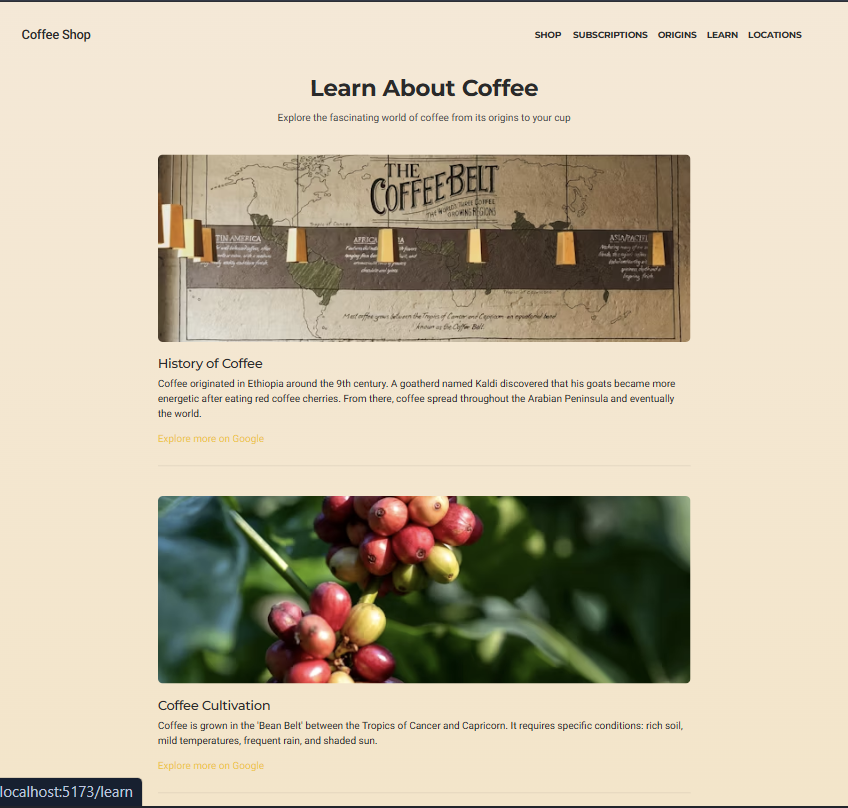
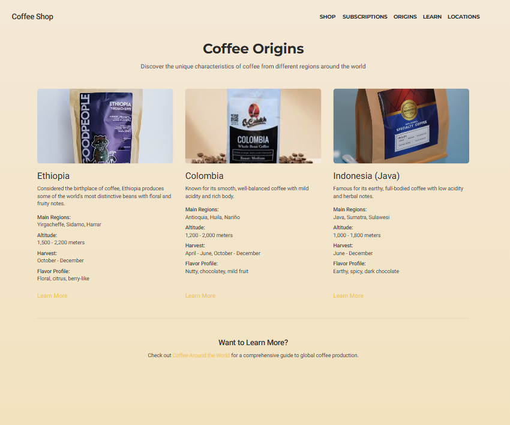
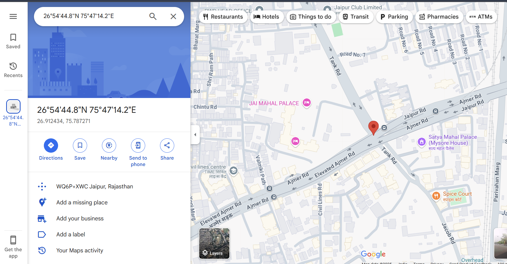
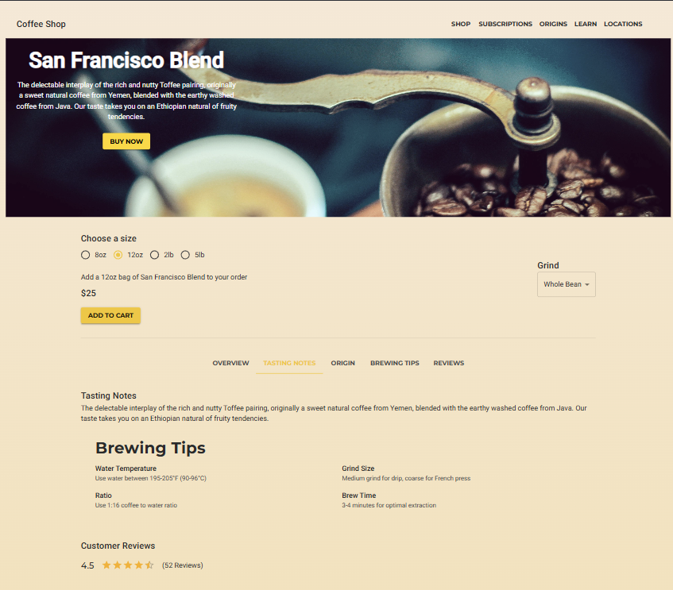
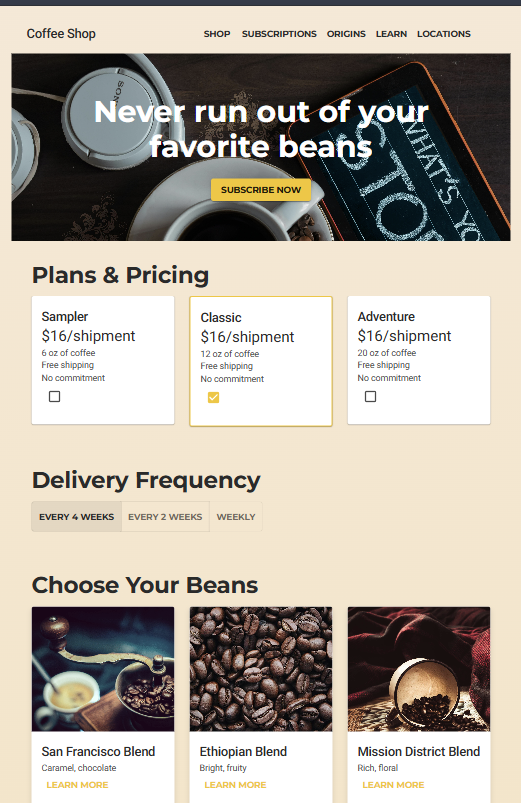

  # ☕ Coffee Beans E-Commerce Website  

Welcome to our premium **Coffee Beans Store**, where you can explore and purchase the finest coffee beans tailored to your taste! Our AI-powered assistant helps you choose the perfect coffee, and we offer flexible subscriptions to suit your needs.  

---

## 🌟 Features  

### ✅ **Personalized AI Coffee Quiz**  
Not sure which coffee suits you? Take our AI-powered **Coffee Quiz**, and we’ll recommend the best coffee based on your taste preferences.  

### ✅ **Flexible Subscriptions**  
Choose from **monthly** or **weekly** coffee bean subscriptions to keep your coffee supply fresh and consistent.  

### ✅ **Learn More About Coffee**  
The **Learn More** page gives you detailed insights into different types of coffee, their origins, and brewing methods to help you make an informed decision.  

### ✅ **Coffee Origins & History**  
Discover the rich **history and origins** of various coffee beans, from their farms to your cup, on the **Origins** page.  

### ✅ **Location-Based Coffee Bean Stores**  
Our **Location** feature detects your **live location** and helps you find the **nearest coffee bean stores** or coffee chains.  

### ✅ **Featured Breakfast & Coffee**  
On the homepage, explore the most **famous coffee blends and breakfast pairings** curated by experts.  

---

## 🚀 How to Get Started  

1. **Explore Coffee Options** – Browse the store and check out different coffee types.  
2. **Take the Quiz** – Get AI-driven recommendations based on your taste.  
3. **Subscribe & Enjoy** – Choose a **weekly or monthly** subscription.  
4. **Find Nearby Stores** – Use the **Location feature** to locate nearby coffee retailers.  

---

## 📸 Snipets  

### Homepage  
  

### AI Quiz  
  

### Learn More Page  
  

### Origins Page  
  

### Locations Page  
  

### Shop Page  
  

### Subscriptions Page  
  

---

## 🔗 Deployment  
- **Frontend**: [Vercel Link](#)   
- **Backend**: [Vercel Link](#) 

---

## 👨‍💻 Tech Stack  
- **Frontend**: React, Tailwind CSS  
- **Backend**: Node.js, Express  
- **Database**: MongoDB  
- **AI Assistant**: OpenAI API  
- **Deployment**: Vercel  

---

## 📬 Contact & Support  
If you have any questions or feedback, feel free to reach out on X(https://x.com/Yashvii_Neema)

Happy Brewing! ☕🚀  
